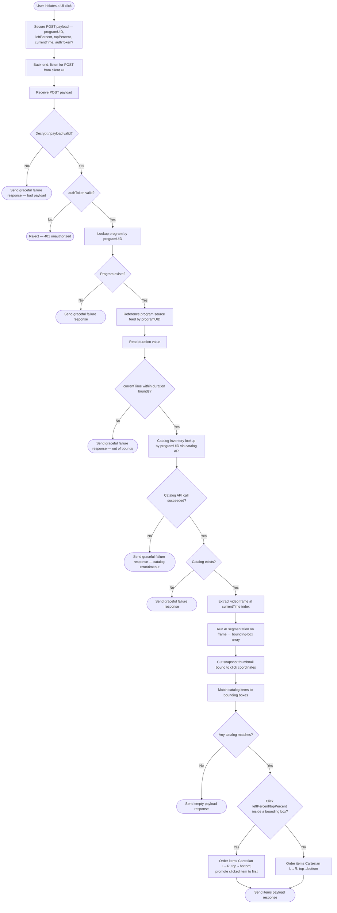

# GrabTV - AI Tagging and Cataloging Service

## Request Payload (Front-End → Back-End)

```jsonc
{
  "programUID": "UID",          // <string>  unique content identifier
  "leftPercent": 00.00,         // <float>   click X as % of frame, 2 dp
  "topPercent": 00.00,          // <float>   click Y as % of frame, 2 dp
  "leftPixels": 00.00,          // <float>?  click X in px, 2 dp (optional)
  "topPixels": 00.00,           // <float>?  click Y in px, 2 dp (optional)
  "currentTime": 00.00,         // <float>   media elapsed time
  "clientViewportWidth": 0,     // <int>?    client viewport width (optional)
  "clientViewportHeight": 0,    // <int>?    client viewport height (optional)
  "authToken": "auth"           // <string>? auth / session token (optional)
}
```

## Flowchart



## Response Payload (Back-End → Front-End)

Single shape covering all three response terminals above — switch on `status`.

```jsonc
{
  status<string>: 'success',          // options: 'success' | 'empty' | 'failure'
  reason<string>?: 'no_matches',      // present only when status = 'empty' | 'failure'
                                      // options: 'invalid_program' | 'out_of_bounds' |
                                      //          'catalog_unavailable' | 'no_matches' |
                                      //          'bad_payload' | 'unauthorized'

  // ---- original client payload, regurgitated verbatim for qualitative correlation ----
  request<object>: {
    programUID<string>: 'UID',
    leftPercent<float>: nn.nn,
    topPercent<float>: nn.nn,
    leftPixels<float>?: nn.nn,
    topPixels<float>?: nn.nn,
    currentTime<float>: nn.nn,
    clientViewportWidth<int>?: n,
    clientViewportHeight<int>?: n
    // authToken deliberately OMITTED — never echo a credential back to the client
  },

  // ---- server-derived context for mapping coordinates ----
  frameWidth<int>: n,                 // px dims of the extracted frame that
  frameHeight<int>: n,                //   all *Pixels values below map to
  itemCount<int>: n,                  // items.length

  // ---- click-bound snapshot, cut from the frame at currentTime (one per request) ----
  snapshot<object>?: {                // present once the frame is extracted (success/empty);
                                      //   absent on early failures (bad payload, invalid program, etc.)
    mimeType<string>: 'image/jpeg',   // options: 'image/jpeg' | 'image/png' | 'image/webp'
    encoding<string>: 'base64',       // options: 'base64'
    data<string>: 'base64blob...',    // the image bytes, base64-encoded resource blob
    width<int>: n,                    // px dimensions of the crop
    height<int>: n,
    leftPercent<float>: nn.nn,        // crop origin within the frame (click-anchored), 2 dp
    topPercent<float>: nn.nn
  },

  items<array>: [                     // [] when status = 'empty' | 'failure'
    {
      itemUID<string>: 'UID',         // required — unique catalog item id
      name<string>: 'Item name',      // required
      description<string>?: 'desc',   // optional

      price<float>?: nn.nn,           // optional
      currency<string>?: 'USD',       // optional — ISO 4217: 'USD' | 'EUR' | 'GBP' | ...
      availability<string>?: 'in_stock', // optional — options: 'in_stock' | 'out_of_stock' |
                                         //   'preorder' | 'discontinued' | 'unknown'

      // ---- position, derived from frame size + correlative percentages ----
      leftPercent<float>: nn.nn,      // required — item anchor X as % of frame, 2 dp
      topPercent<float>: nn.nn,       // required — item anchor Y as % of frame, 2 dp
      leftPixels<float>?: nn.nn,      // optional — = leftPercent/100 * frameWidth, 2 dp
      topPixels<float>?: nn.nn,       // optional — = topPercent/100 * frameHeight, 2 dp

      boundingBox<object>: {          // required — segmentation box, percent-based
        leftPercent<float>: nn.nn,
        topPercent<float>: nn.nn,
        widthPercent<float>: nn.nn,
        heightPercent<float>: nn.nn
      },

      clickMatch<bool>?: true,        // optional — true for the item whose bbox contains the click
                                      //   (that item is first in the list); absent/false otherwise
      proximity<float>?: nn.nn,       // optional — distance click→anchor (informational, not the sort key)
      confidence<float>?: nn.nn,      // optional — 0.00–1.00
      thumbnailUrl<string>?: 'url',   // optional — catalog/product image (distinct from top-level snapshot)
      purchaseUrl<string>?: 'url'     // optional — deep link to catalog/checkout
    }
    // ...additional items — pre-ordered: clicked item first (if any), then Cartesian L→R, top→bottom
  ]
}
```
