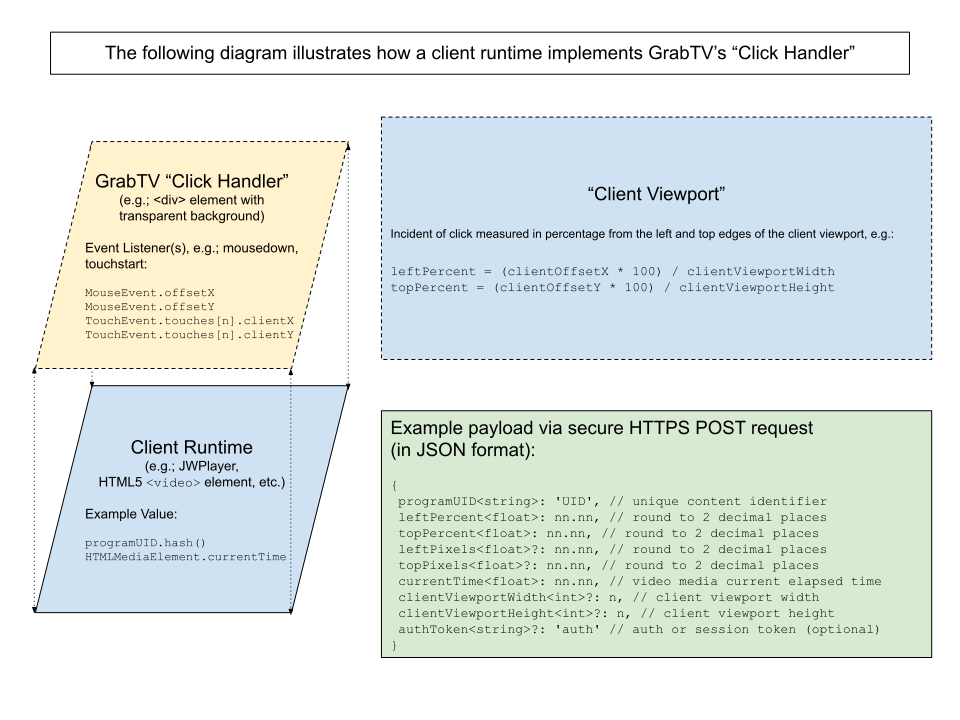

# GrabTV Telemetry & UI Injection Service

The GrabTV Telemetry and UI Injection Service is a lightweight solution for tracking user interactions on video content. Using developer-friendly APIs, it overlays custom UI elements onto standard HTML5 videos to capture click and touch events, sending real-time telemetry data directly to proprietary collection services.

---

## System Architecture

<p align="center">
  
</p>

---

## Client-Side Integration Guide

To integrate GrabTV tracking into a host document, include the client SDK CDN script and satisfy the DOM element fallbacks.

### 1. Include the SDK Script
Add the CDN `<script>` tag inside the document `<head>` (preferred) or `<body>` tag:

```html
<!-- Include GrabTV SDK (Served from the service CDN endpoint) -->
<script src="https://sandbox.grabtv.com/grabtv-client.js"></script>
```

*Note: A production CDN link will be provided upon completion of Commercial License Agreement with Grab Holdings, Inc. Replace the sandbox CDN link with the production CDN link in production.*

### 2. Prepare the DOM Elements
The SDK scans the host document DOM tree upon the `onload` event to locate a standard HTML5 `<video>` element (or YouTube player target) and a matching telemetry layer target.

#### Video Element Scanning Hierarchy:
In cases where there are multiple `<video>` elements present in the DOM, the SDK determines which instance to operate on based on the following hierarchy:
1.  An element with the ID attribute `id="target-video"`.
2.  An element with the class name attribute `class="target-video"`.
3.  Fallback: If neither ID nor class is specified, the **LAST** `<video>` element node in the DOM tree will be selected.

If no standard HTML5 `<video>` element is found in the DOM (and no YouTube player target is cued), the SDK will gracefully exit and report a console error message.

The tracking layer will be scanned in the following fallback hierarchy:
1.  An element with the tag name `<click-handler>`
2.  A `<div>` element with the ID attribute `id="click-handler"`
3.  A `<div>` element with the class name attribute `class="click-handler"`

#### DOM Placement Rule
If the located click-handler is not positioned immediately adjacent following the media element, the SDK programmatically reorganizes the DOM tree structure at runtime to place it directly after the media node before executing any overlay math.

#### Media State and Polling Rule
The SDK service will listen for the standard `canplay` event of the `<video>` element before starting the `currentTime` polling routine. If the video's readyState indicates it has already loaded when initialization runs, the polling loop starts immediately. If a YouTube IFrame Player is used as the source, the service listens for the YouTube IFrame Player's `onReady` event (the "can play" equivalent) before starting the `currentTime` polling.

#### Example DOM Structure:
```html
<div class="video-container">
  <!-- The target video -->
  <video id="target-video" controls>
    <source src="video.mp4" type="video/mp4">
  </video>

  <!-- The telemetry handler (Using ID fallback) -->
  <div id="click-handler"></div>
</div>
```

---

## Client-Side Configuration Settings

Developers configure SDK states via browser environment window attributes. These must be defined before or during the document `onload` event.

### 1. Initialize the Content Program ID (Required)
Every integration requires a hashed program identifier generated via `window.generateProgramIdHash(programId)`:

```html
<script>
  window.addEventListener('DOMContentLoaded', () => {
    // Generate standard hashed key based on content program label
    window.programId = window.generateProgramIdHash("my-premium-showcase-video");
  });
</script>
```
*Note: If `window.programId` is not defined when the page completes loading, the SDK prints an error to the developer console and gracefully exits.*

#### Program ID Validation Constraints
The input `programId` parameter must satisfy the following strict validation rules:
- **No Spaces**: The identifier must not contain any space characters.
- **Allowed Characters**: Can only contain mixed-case alphanumeric characters (`a-z`, `A-Z`, `0-9`), dashes (`-`), and underscores (`_`).
- **Length Boundaries**: Must be at least 7 characters and at most 44 characters in length.

### 2. Enable Sandbox Mode (Optional)
To verify correct placement and tracking, pass a Google Analytics Measurement ID to `window.measurementId`.

```javascript
window.measurementId = "G-XXXXXXXXXX"; // Dev Sandbox ID
```
When a measurement ID is initialized, the SDK enters **Sandbox Mode**:
*   Dispatches an initial page_view ping to Google Analytics to test connection integrity. (SDK exits gracefully with an error if Google Analytics is unreachable).
*   Propagates all click and touch telemetry payloads to the developer's Google Analytics Console as custom events (`click_telemetry`) in real time.

#### Auditing Sandbox Engagement

If you are in "sandbox mode", you will need to understand Google Analytics Realtime Report feature in order to audit click-handler engagement from the user. For more information, visit: https://youtu.be/tFGdHCUST6g?si=xYqyUbJ7xRZTWaSb&t=340

#### Telemetry Payload Schema

When a user clicks or taps anywhere within the bounding dimensions of the click-handler element, the SDK translates the client coordinates relative to the video aspect frame and POSTs the following JSON payload to `/api/telemetry`:

```json
{
  "programUID": "prg_82c6de34",
  "leftPercent": 34.82,
  "topPercent": 56.12,
  "leftPixels": 222.85,
  "topPixels": 359.17,
  "currentTime": 14.52,
  "clientViewportWidth": 1920,
  "clientViewportHeight": 1080,
  "authToken": "sess_8x8b2u9a"
}
```

#### Parameter Explanations & Types:
*   `programUID` *(string)*: Unique content identifier hash.
*   `leftPercent` *(float)*: X-coordinate percentage relative to the video frame width, rounded to 2 decimal places.
*   `topPercent` *(float)*: Y-coordinate percentage relative to the video frame height, rounded to 2 decimal places.
*   `leftPixels` *(float, optional)*: X-coordinate offsets in pixels, rounded to 2 decimal places.
*   `topPixels` *(float, optional)*: Y-coordinate offsets in pixels, rounded to 2 decimal places.
*   `currentTime` *(float)*: Video media player elapsed playhead time in seconds at the time of click.
*   `clientViewportWidth` *(integer, optional)*: Browser viewport window width in pixels.
*   `clientViewportHeight` *(integer, optional)*: Browser viewport window height in pixels.
*   `authToken` *(string, optional)*: Production session authorization token, if generated.

### 3. Generate a Production Session Token (Optional)
Production authorized tracking outside of Sandbox Mode requires an active `sessionToken`. Secure tokens are generated via server-side verification:

```javascript
// Call the global helper to verify keys and acquire a session token
window.generateSessionToken("api_key_here", "api_secret_here")
  .then(token => console.log("Authorized session token:", token))
  .catch(err => console.error("Authorization failed:", err));
```
When verified, the SDK sets `window.sessionToken` and includes the token under `authToken` in all telemetry payloads.
